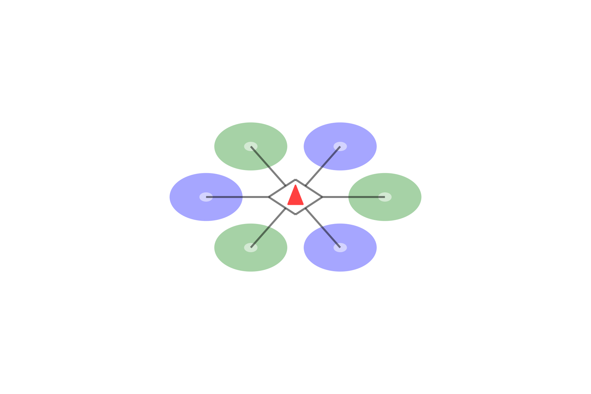

# ControlAllocationSwitching
- A repository for the codes used in the paper,
**Jinrae Kim et al., "Control Allocation Switching Scheme for Fault Tolerant Control of Hexacopter", presented in [2021 Asia-Pacific International Symposium on Aerospace Technology (APISAT2021), Jeju, Korea](https://apisat2021.org/)**.
# Notes
## Dependencies (will automatically be installed via `Project.toml`)
- [Julia](https://julialang.org/) v1.6.2
- To run the simulation, [FaultTolerantControl.jl](https://github.com/JinraeKim/FaultTolerantControl.jl) v0.1.0
- To draw figures, [FlightSims.jl](https://github.com/JinraeKim/FaultTolerantControl.jl) v0.7.10
- etc.

# How to reproduce the simulation result?
## Simulation
Run the function `test()` in `main/main.jl`.
## Drawing figures
Run the function `test()` in `main/figures.jl`.
### Examples
- Hexacopter description

- Top view

- Problem description

- Scheme description

